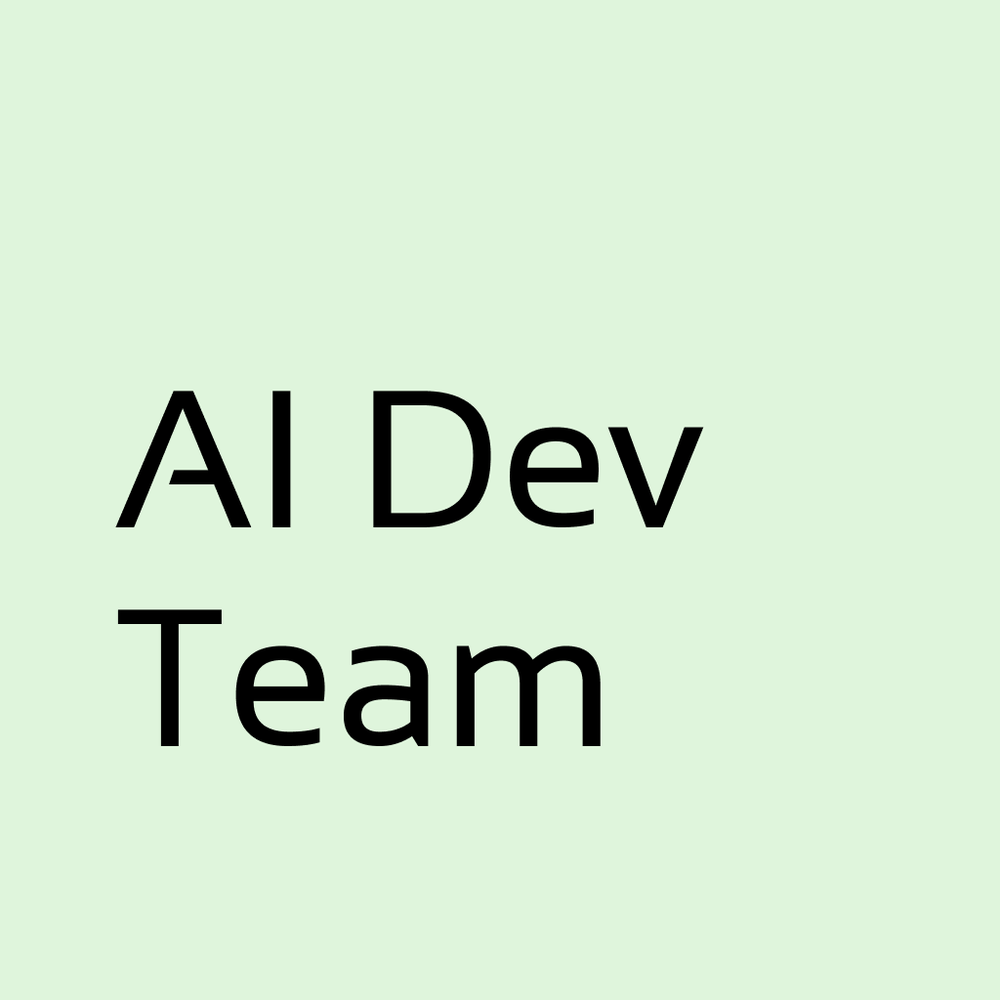

<p align="center">
  
</p>

<h1 align="center">Olly Molly</h1>

<p align="center">
  <strong>Your AI Development Team, Running Locally</strong>
</p>

<p align="center">
  <a href="#quick-start">Quick Start</a> •
  <a href="#features">Features</a> •
  <a href="#how-it-works">How It Works</a> •
  <a href="#contributing">Contributing</a>
</p>

<p align="center">
  
  
  
</p>

---

**Olly Molly** is a local-first AI development team manager. Assign tasks to AI agents (PM, Frontend, Backend, QA) and watch them work on your codebase—all from a beautiful kanban board interface.

## Quick Start

```bash
npx olly-molly
```

That's it. Open `http://localhost:1234` and start managing your AI team.

## Features

- 🎯 **Kanban Board** — Drag-and-drop task management
- 🤖 **AI Agents** — PM, Frontend Dev, Backend Dev, QA agents
- 💬 **Natural Requests** — Ask PM in plain language, get structured tickets
- 🔒 **Local-First** — Everything runs on your machine
- 🎨 **Minimal Design** — Clean, paper-like UI inspired by fontshare.com
- 🌙 **Dark Mode** — Easy on the eyes

## How It Works

```
┌─────────────────────────────────────────────────────────┐
│                      Olly Molly                         │
├─────────────────────────────────────────────────────────┤
│                                                         │
│  You ──▶ PM Agent ──▶ Creates Tickets                  │
│              │                                          │
│              ▼                                          │
│  ┌─────────────────────────────────────────────────┐   │
│  │  TODO  │  PROGRESS  │  REVIEW  │  DONE  │ HOLD  │   │
│  │   📋   │     🔄     │    👀    │   ✅   │  ⏸️   │   │
│  └─────────────────────────────────────────────────┘   │
│              │                                          │
│              ▼                                          │
│  Agents (FE/BE/QA) work on assigned tickets            │
│              │                                          │
│              ▼                                          │
│  Code changes in YOUR local project                    │
│                                                         │
└─────────────────────────────────────────────────────────┘
```

## Setup

### Prerequisites

- Node.js 18+
- OpenAI API key (or compatible provider)

### Run with npx (Recommended)

```bash
npx olly-molly
```

### Or install globally

```bash
npm install -g olly-molly
olly-molly
```

### Development

```bash
git clone https://github.com/ruucm/olly-molly.git
cd olly-molly
npm install
npm run dev
```

### AI CLI Tools (Required for Agent Execution)

To run AI agents, you need to install either OpenCode or Claude CLI:

**macOS (via Homebrew):**
```bash
# OpenCode
brew install sst/tap/opencode

# Claude CLI
brew install anthropics/tap/claude-code
```

**Windows:**
```bash
# OpenCode (via npm)
npm install -g opencode-ai

# Claude CLI (via npm)
npm install -g @anthropic-ai/claude-code
```

> **Note:** Windows npm packages may not be officially supported. If installation fails, consider using WSL (Windows Subsystem for Linux) with Homebrew.

## Configuration

On first launch, you'll be prompted to enter your OpenAI API key. This is stored locally in your browser's localStorage.

You can also set it via environment variable:

```bash
export OPENAI_API_KEY=your-key-here
npx olly-molly
```

## Project Selection

1. Click "Select Project" in the header
2. Add your project path (e.g., `/Users/you/my-app`)
3. AI agents will work within that directory

## Contributing

We love contributions! Here's how you can help:

### Ways to Contribute

- 🐛 **Bug Reports** — Found a bug? Open an issue
- 💡 **Feature Requests** — Have an idea? Let's discuss
- 🔧 **Pull Requests** — Code contributions are welcome
- 📖 **Documentation** — Help improve our docs
- 🎨 **Design** — UI/UX improvements

### Development Setup

```bash
# Clone the repo
git clone https://github.com/ruucm/olly-molly.git
cd olly-molly

# Install dependencies
npm install

# Start development server
npm run dev

# Open http://localhost:1234
```

### Project Structure

```
olly-molly/
├── app/                 # Next.js app router
│   ├── api/            # API routes
│   ├── design-system/  # Design system docs
│   └── page.tsx        # Main dashboard
├── components/         # React components
│   ├── kanban/        # Kanban board
│   ├── ui/            # Reusable UI components
│   └── ...
├── db/                 # SQLite schemas
└── lib/               # Utilities
```

### Code Style

- TypeScript for type safety
- Functional components with hooks
- CSS variables for theming
- Minimal dependencies

## Tech Stack

- **Framework**: Next.js 16
- **UI**: React 19, Tailwind CSS 4
- **Database**: SQLite (better-sqlite3)
- **Drag & Drop**: dnd-kit
- **AI**: OpenAI API

## License

MIT © ruucm

---

<p align="center">
  <sub>Built with ❤️ for developers who love AI</sub>
</p>
